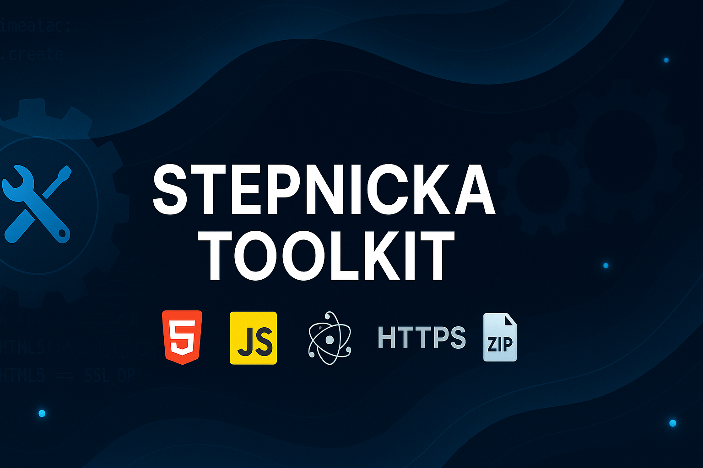
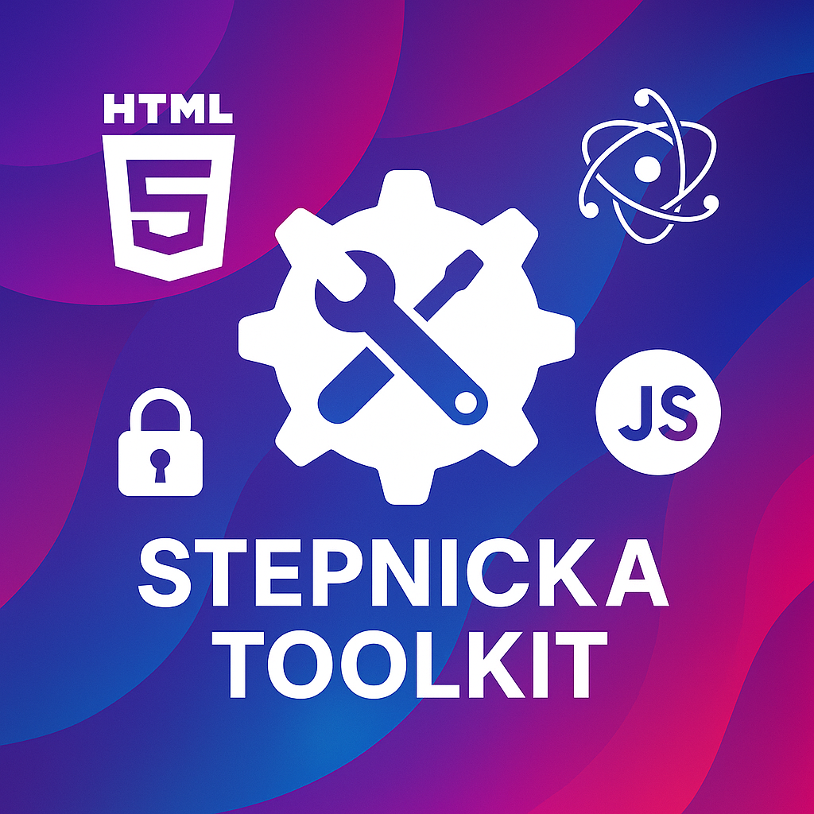
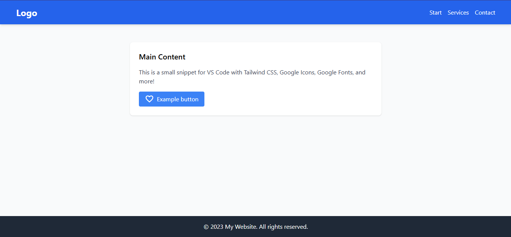

# Change Log
All updates for [Stepnicka-ToolKit]

## Social
[Instagram] (https://instagram.com/stepnickast)  
[Github] (https://github.com/StepnickaStudios/)  
[Youtube] (https://www.youtube.com/@StepLauncher-MC)

    <h1> How To Use It? <h1>  
    <h3>
    Type !ST and the snippets will appear. It depends on the language you're using. For example, if you're using   JavaScript, snippets for that language will appear. The same will happen with HTML. HTML snippets will appear.
    </h3>

 

## 🔥Release

## [1.1.0] - 2025-05-10

### 🛠️ Bug Fix :
 - Create-New-App-Electron : Fixed

### ❌ Removed :
- HTML Elements

### 📦 Added :
- New Snippets for HTML setup, including [ Meta, TaildwindCss, Material Icons, and Google Fonts Icons, Mini WebPage, etc ]

 
- Adm-Zip : Download Zip files easily and unzip them
- ## 📂 Snippets Explorer Panel
- The Stepnicka Toolkit extension now includes a custom Snippets ST panel directly in the Activity Bar!
- 📦 Organized list of HTML and JavaScript snippets
- 💡 Easily insert snippets into your editor with one click
- ❤️ Dedicated Support button to show love for the project

- You’ll find this panel on the left sidebar under the Snippets ST icon.

## [1.0.0] - 2025-04-27
### Added
- Snippets for basic HTML setup, including TailwindCSS, Material Icons, and Google Fonts.
- Template for Electron window with custom title bar and button controls.
- Spinner loader with custom animation.
- Cookie consent banner with custom styling, buttons, and animations.